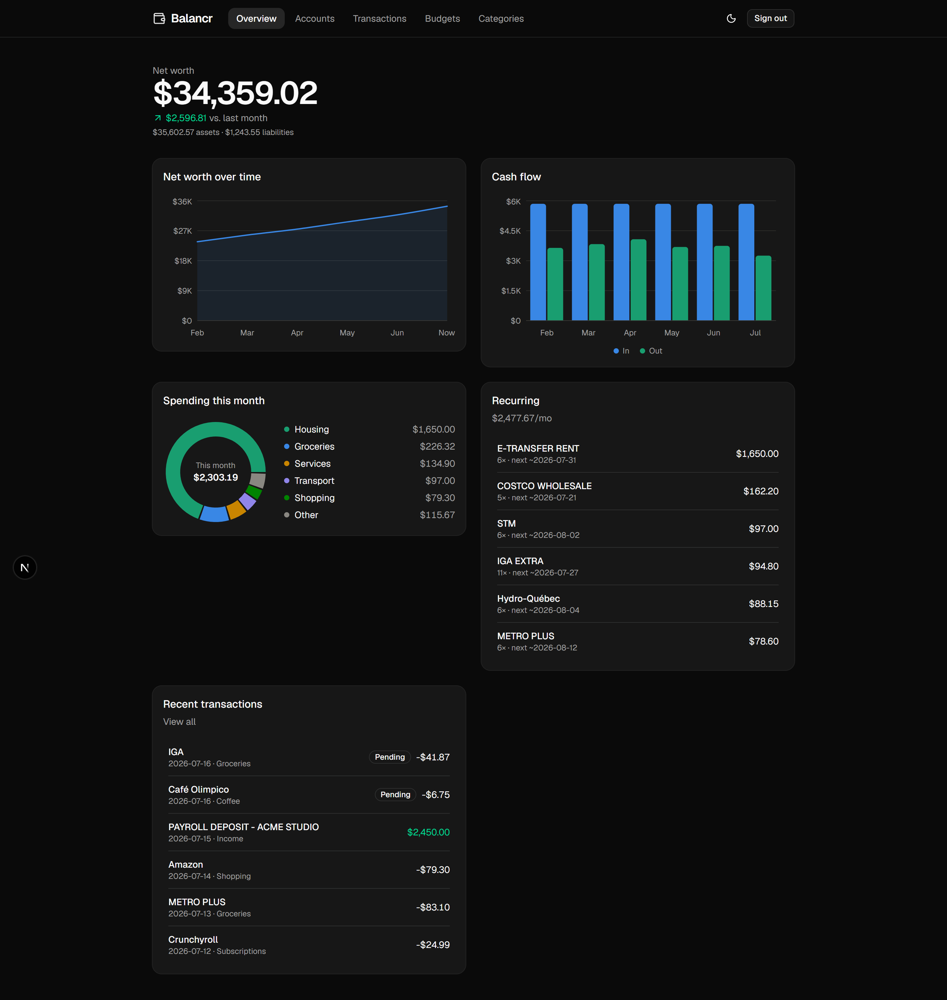
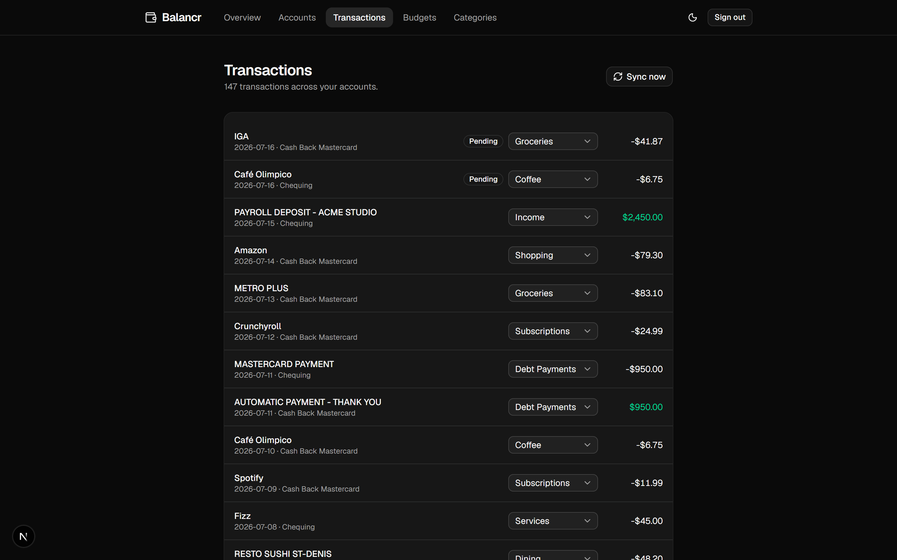
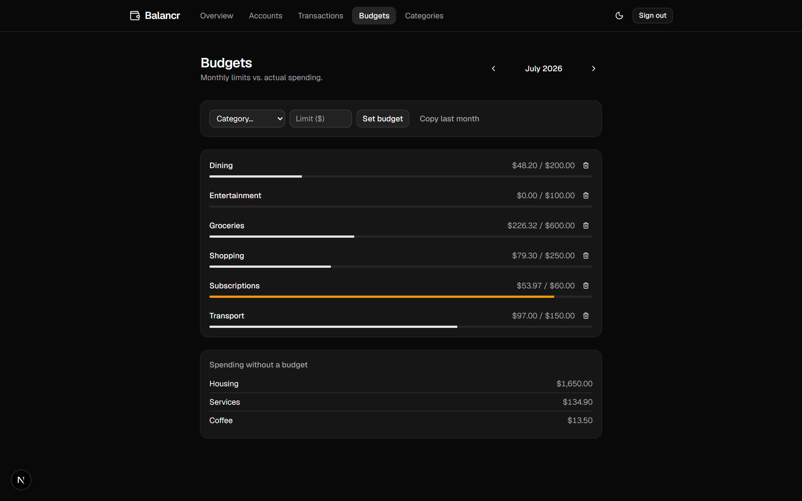
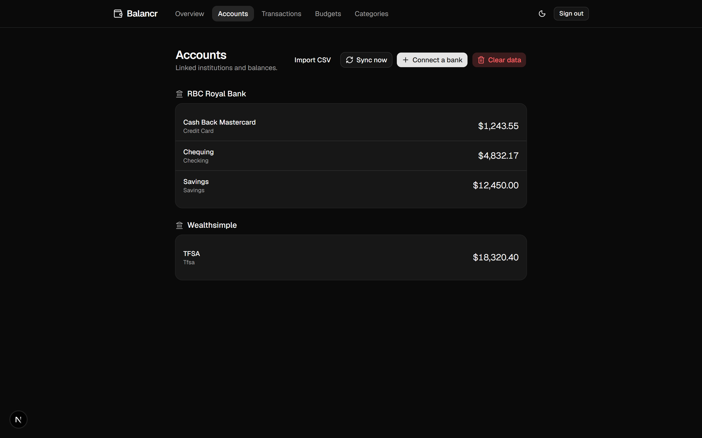

# Balancr

**Personal finance, balanced.** Link your banks, watch your money.

Balancr pulls real bank accounts in through Plaid, keeps transactions synced and categorized, and turns them into a clean picture of your net worth, cash flow, and spending — dark mode included.



<p align="center">
  
  
  
</p>

## Features

- **Bank linking** — Plaid Link, sandbox or production behind a single env var
- **Transaction sync** — cursor-based incremental syncs, signed-webhook updates, idempotent de-duplication
- **Self-healing re-connects** — expired bank logins are detected, surfaced as a banner, and fixed through Link update mode
- **Auto-categorization** — Plaid categories map to your taxonomy; a manual fix can become a rule that wins forever after
- **Budgets** — monthly limits per category with live progress (amber near limit, red over)
- **Dashboard** — net worth with asset/liability split, 6-month trend, cash flow, spending donut, recurring-charge detection
- **CSV import** — bilingual (EN/FR) column auto-mapping, decimal-comma amounts, preview before commit, hash-based de-dup, manual accounts for banks Plaid can't reach
- **Auth** — NextAuth v5, JWT sessions, every query scoped to the signed-in user

## Stack

Next.js (App Router, TypeScript) · Tailwind v4 + shadcn/ui · Postgres (Neon) + Prisma · NextAuth v5 · Plaid · Recharts · Vercel

## Running locally

```bash
git clone https://github.com/Mickunaru/balancr && cd balancr
npm install
cp .env.example .env   # Neon DATABASE_URL, AUTH_SECRET, ENCRYPTION_KEY, Plaid sandbox keys
npx prisma migrate dev
npm run dev
```

Runs in Plaid **sandbox** by default — link a bank with `user_good` / `pass_good`, no real bank needed.

Webhooks need a public URL: `npm run tunnel`, set `APP_URL`, restart. Without one, *Sync now* covers manual pulls.

A production profile (`.env.production.local` + `npm run dev:production`) runs the same code against real Plaid keys and a separate database.

## License

MIT
