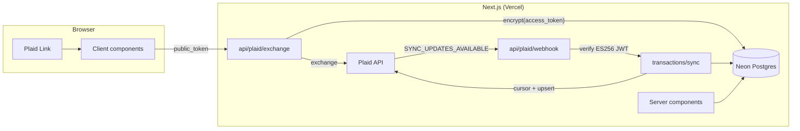

# Balancr

**Personal finance, balanced.** Link real bank accounts through Plaid, auto-sync and categorize transactions, set monthly budgets, and watch net worth, cash flow, and spending on a clean dashboard — dark mode included.


**Live demo:** [balancr on Vercel](https://balancr.vercel.app) — running in Plaid **sandbox**. Create an account, click *Connect a bank*, and log in with Plaid's test credentials `user_good` / `pass_good`. No real bank, no real data.

---

## Features

- **Bank linking** via Plaid Link (sandbox for the demo, production Trial for real RBC + Wealthsimple accounts — one env var switches)
- **Transaction sync** — cursor-based `/transactions/sync` with webhook-driven incremental updates and idempotent de-duplication
- **Re-connect flow** — expired Items (Wealthsimple re-auths every ~30 days) are detected via API errors *and* webhooks, surfaced as a banner, and recovered through Plaid Link update mode
- **Auto-categorization** — Plaid categories map to a personal taxonomy; manual re-categorization can become a remembered rule that wins over the default mapping on every future sync
- **Budgets** — per-category monthly limits with live budget-vs-actual bars (amber near limit, red over)
- **Dashboard** — net worth hero with asset/liability split, net-worth trend, cash-flow in/out, spending donut, recurring-charge detection, recent transactions
- **CSV import** — column mapping, date-format and sign-convention handling, preview, and hash-based de-dup; manual accounts for banks Plaid can't reach
- **Auth** — NextAuth v5 (credentials + Google-ready), JWT sessions, every query scoped to the signed-in user

## Stack

Next.js (App Router, TypeScript) · Tailwind v4 + shadcn/ui · Postgres (Neon) + Prisma 7 · NextAuth v5 · Plaid · Recharts · Vercel

## Architecture



**The Plaid flow:** the client opens Plaid Link and hands the resulting `public_token` to a route handler, which exchanges it for an `access_token`, encrypts it, and stores the Item plus its accounts atomically. Plaid then posts `SYNC_UPDATES_AVAILABLE` webhooks; the handler verifies the ES256 signature (key fetched by `kid` and cached, body hash compared with `timingSafeEqual`) and pulls the delta through cursor-based `/transactions/sync`.

## Engineering decisions

- **Money is integer cents, never floats.** Every amount in the schema is an `Int` in cents; formatting to dollars happens only at render time. No `0.1 + 0.2` bugs in a finance app.
- **Plaid access tokens are encrypted at rest** (AES-256-GCM, random IV, auth tag verified on decrypt). A leaked database dump exposes ciphertext, not bank credentials. Tokens are treated like passwords: never logged, never sent to the client.
- **Sync is idempotent by construction.** Every transaction upserts on a unique `plaidTxnId`; CSV imports synthesize deterministic `csv-<sha256>` ids in the same column. Re-running a sync, replaying a cursor from scratch, or re-importing the same file changes nothing — proven by tests that replay full history and assert identical row counts.
- **Liabilities subtract.** Plaid reports credit-card and loan balances as positive amounts *owed*; net worth classifies by account type and subtracts them. The sandbox fixture (mortgage + student loan) makes naive summing off by ~$250K.
- **Net-worth history is reconstructed, not stored.** `netWorth(t) = netWorthNow + Σ txn amounts after t` — one formula covers assets and liabilities because Plaid's sign convention (positive = money out) applies uniformly.
- **Rules win over mappings.** Categorization resolves user rules first, Plaid's `personal_finance_category` second, and manual choices are never overwritten by sync updates.
- **One env var switches environments.** `PLAID_ENV=sandbox` runs the public demo; `PLAID_ENV=production` (Plaid Trial) runs the private real-data instance. Same codebase, separate database and secrets, never mixed.

## Running locally

```bash
git clone <repo> && cd balancr
npm install
cp .env.example .env   # fill in: Neon DATABASE_URL, AUTH_SECRET, ENCRYPTION_KEY, Plaid sandbox keys
npx prisma migrate dev
npm run dev
```

Webhooks need a public URL: run `ngrok http 3000`, set `APP_URL` to the tunnel URL, and restart. Without it, the *Sync now* button covers manual pulls.

A production profile lives in `.env.production.local` and runs with `npm run dev:production` (real Plaid keys, separate database).

## Testing the re-connect flow

```
POST /sandbox/item/reset_login  →  next sync throws ITEM_LOGIN_REQUIRED
→ Item flagged, banner appears  →  Reconnect opens Link update mode
→ user_good / pass_good         →  Item active, backlog synced
```

## License

MIT
